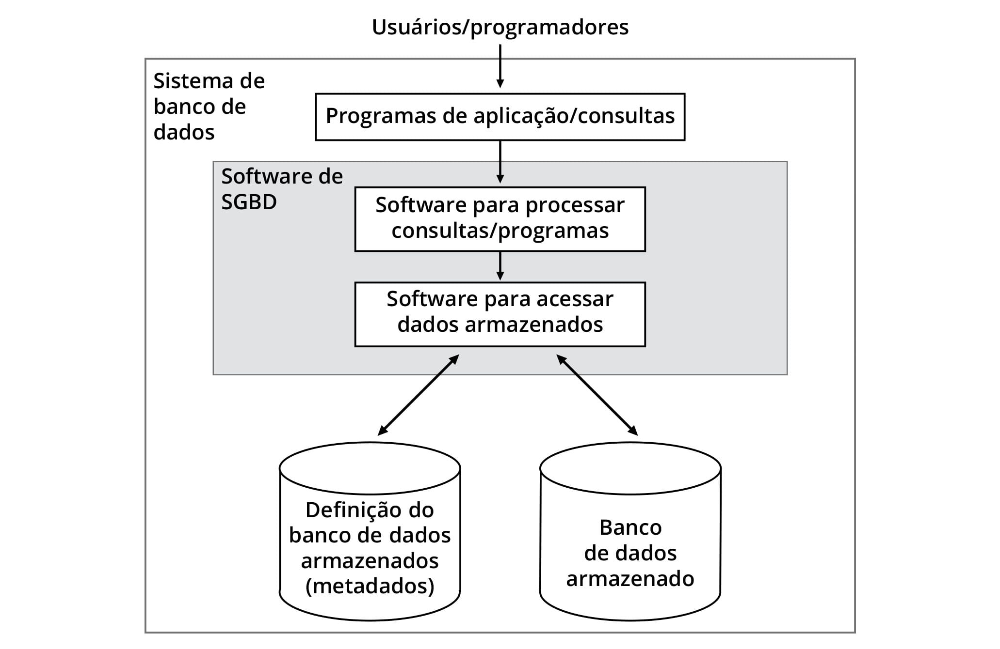

# Sistema de banco de dados

Banco de dados = 'banco de dados é uma coleção de dados relacionados'

sgbd = 'independência entre dados e programas'

banco ---- sdbd ---- aplicação

middleware = 'O middleware é um software que diferentes aplicações usam para se
comunicar umas com as outras. Ele oferece funcionalidade para conectar
aplicações de modo inteligente e eficiente, para que você possa inovar mais
rapidamente. O middleware atua como uma ponte entre diversas tecnologias,
ferramentas e bancos de dados para integrá-los perfeitamente em um único
sistema.'

fonte de dados ---- middleware ---- aplicação web

### Tabelas

| Descrição | Significado |
| --------- | ----------- |
| Atributo | colunas |
| Valores dos atributos | conteúdo |
| Tipos | int, char, boolean |
| Esquema | conjunto de atributos de um tabela |
| Tupla | linha de uma tabela |
| Instância | conjunto de linhas de uma tabela |
| Campo | encontro da linha com a coluna |
| Valor | conteúdo de um campo |
| Nulo | ausência de valor em um campo |
| Chave primária | id da tabela (provê a integridade de chave primária) |
| Chave primária composta | quando utiliza o valor de duas tabelas |
| Chave candidata | quando um campos é único e pode se utilizado como pk |
| Chave estrangeira | provê a ligação entre as tabelas relacionada |

### Diferenças entre sistema de arquivos e sistema de banco de dados

#### Níveis de esquemas

- O __nível interno__: Descreve como os dados são armazenados no computador
como: tipos de arquivos, formatos e ordenação de registros e caminhos de
acesso.

- O __nível conceitual__: São aqueles que representam, de maneira abstrata, a
implementação dos bancos de dados, ocultando detalhes de como os dados são
armazenados e acessados no disco.

- O __nível externo__: São aqueles que representam a visão dos dados do ponto
de vista do usuário final, no nível de abstração mais próximo do mundo real.

#### Gera dois tipos de idependências

- __Independência lógica de dados__: consiste em alterar o esquema conceitual
lógico sem afetar o esquema conceitual externo.

- __Independência física de dados__: consiste em alterar o esquema conceitual
físico (com a reestruturação dos arquivos, diretório ou partição do banco) sem
afetar o esquema conceitual lógico ou externo.

outras características:

- Natureza autocontida: trata-se dos metadados, que contém descrições sobre
estruturas e restrições das tabelas.

- Abstração de dados: trata-se do ocultamento no modelo conceitual de dados
dos metadados retratados anteriormente.

- Suporte ao compartilhamento de dados e processamento de transações
concorrentes: trata-se da do acesso concorrente - múltiplo - aos dados contidos
no sbd.

> Nota: quando é alterado algo na estrutura do arquivo do modelo tradicional,
> o software terá que ser readaptado para manter a fluência na comunicação,
> porém, no modelo com a adição dos sgbd's uma alteração na estrutura do
> arquivo apenas impacta na reformulação dos arquivos com os metadados dos
> dados em questão, onde isso é responsabilidade so próprio sgbd.

#### Garantias providas pelo SGBD - ACID

- Atomicidade: Cada transação é tratada como uma unidade composta de uma
sequência de operações, de modo que deve executar completamente com sucesso ou
falhar completamente.

  - Begin Transaction: Trata-se da operação que marca o início da transação
  e só será encerrada com um commit ou rollback.

  - Commit: Trata-se da operação que indica que a transação foi realizada com
  êxito, portanto os concluída e os dados originais sobrepostos.

  - Rollback: Trata-se da operação que indica que a transação foi realizada com
  falha, portanto será abortada e os dados originais serão mantidos.

- Consistência: Uma transação só pode levar o banco de dados de um estado
válido para outro, de acordo com suas regras de integridade, ou seja, embora
exista o acesso múltiplo, as transações são sequenciais para prover a
consistência nos dados.

- Isolamento: Cada transação é isolada das demais, isto é, essa propriedade
assegura que transações executadas concorrentemente levem o banco de dados ao
mesmo estado que chegaria se as transações fossem executadas sequencialmente.

- Durabilidade: Uma vez que a transação é aceita (committed), o que significa
que seu resultado foi gravado em memória não volátil, esse resultado
permanecerá válido mesmo em caso de falhas do sistema através dos mecanismo de
recuperação.

### Descrever a arquitetura dos sistemas de gerência de banco de dados (SGBD)

#### Componentes de um sistema de banco de dados

Ao falarmos sobre SBD e SGBD, os termos embora semelhantes tem funções
diferentes! SBD é o banco de dados propriamente dito, com os dados separados em
arquivos de acordo com sua estrutura, por sua vez, o SGBD de uma forma simples
pode ser resumido ao software para processar consultas e/ou programas e outro
software para acessar os dados (metadados e o próprio banco de dados).

  

> Nota: __Metadados__ são denominados como o esquema do banco de dados, onde o
> mesmo é estruturado de acordo com o modelo lógico de implementação do banco.

O conteúdo de um banco de dados é denominado de _estado_ ou _instância_, onde
a cada adição, remoção ou atualização de dados provoca uma mudança de estado,
gerando uma nova instância do banco de dados.

#### Módulos de um sistema de gerência de banco de dados

A figura a seguir ilustra, em detalhes, os diversos módulos que compõem um
SGBD, sendo a parte superior correspondente ao processamento das consultas e
aplicações, e a parte inferior ao acesso a metadados e dados armazenados
(a base de dados).

  

> Nota: As __linhas tracejadas__ denotam fluxo de controle, enquanto as
> __linhas cheias__ representam fluxo de dados.

- __Usuários__: Administrador de banco de dados - Database Administrator - DBA.

- __Usuários casuais__: Trata-se de usuários que geram esporadicamente
consultas no banco de dados.

- __Programadores de aplicações__: Trata-se literalmente dos desenvolvedores.

- __Programas de aplicação__: São sistemas que podem utilizar de um orm ou lib
da linguagem como também a próprio sql.

- __Pré-compilador__: Os programas de aplicação são processados, inicialmente,
por um pré-compilador, responsável por separar os comandos e os repassar para
os compiladores das respectivas linguagens - (Ex: orm interno ou lib como
psycopg2).

- __Compiladores__: Cabe a esses compiladores produzir o código das aplicações
sob a forma de transações executáveis, que ficam à disposição dos usuários
paramétricos.

- __Usuários paramétricos__: Trata-se dos usuários que interagem com o sistema
através de parâmetros passados em interfaces apropriadas/restritas.

- __Catálogo do sistema__: Trata-se dos metadados dos dados do banco.

- __Transações compiladas__: Uma vez executadas as transações compiladas, assim
como os demais comandos provenientes de usuários ou aplicações, são passadas ao
nó central do SGBD para posterior processamento do processador de runtime.

- __Processamento do acesso aos dados armazenados__: Prosseguindo para a parte
do processamento do acesso aos dados armazenados, observamos que o processador
de runtime é o coração do SGBD.

- __Gerenciador de dados armazenados__: O processador de runtime também precisa
acessar e, por vezes, modificar o catálogo, dependendo da natureza dos
comandos, das consultas ou transações que estiver processando. Para isso é
utilizado um software auxiliar que informa fisicamente onde se encontra o
arquivo em questão para extração, criação, atualização ou remoção de dados.

- __Subsistemas de controle de concorrência/backup/recuperação__: Software
auxiliar que provê o acesso de forma sequencial para qualquer tipo de
informação, assim como realizar backup e restauração de um database.

#### Diferença entre modelos de banco de dados

- __Sistema de arquivos__: Trata-se do modo tradicional de armazenamento de
dados em arquivos - útil com o manuseio de dados estáticos e em pouca
quantidade.

- __Banco de dados relacionais - BDR__: Trata-se do banco de dados com
utilização da linguagem sql.

- __Banco de dados orientados a objetos - BDOO__: São banco de dados com uma
limitação de dados um pouco menor quando comparado com os banco de dados
relacionais, porém não se utiliza de uma linguagem declarativa (sql).

- __Banco de dados objeto relacional - BDOR__: É a junção do banco de dados
relacional com o orientado a objeto, ou seja, quando posso utilizar da
linguagem sql e ainda manipular tipos de dados complexos quando comparado ao
BDR.

#### Diferença entre arquiteturas

- __Monolítica__: Também conhecida como _arquitetura centralizada_, refere-se
a centralização do processamento em um servidor local.

- __Rede__: Também conhecida como _arquitetura servidor de arquivo_, refere-se
ao modelo onde a aplicação e o sgbd ficam hospedados no host do cliente e o
servidor de arquivos junto a base de dados no servidor.

- __Cliente/Servidor__: Também conhecida como _arquitetura servidor de sql_ ou
__banco de dados__, refere-se a aplicação local no host do cliente (salvo com
aplicações web) e o banco localizado no servidor.
