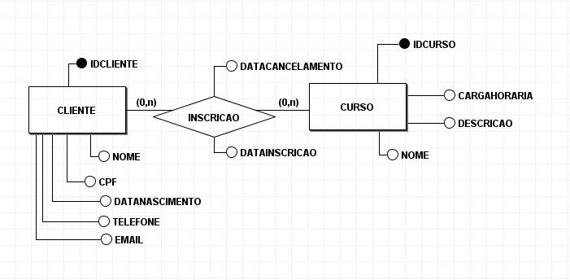
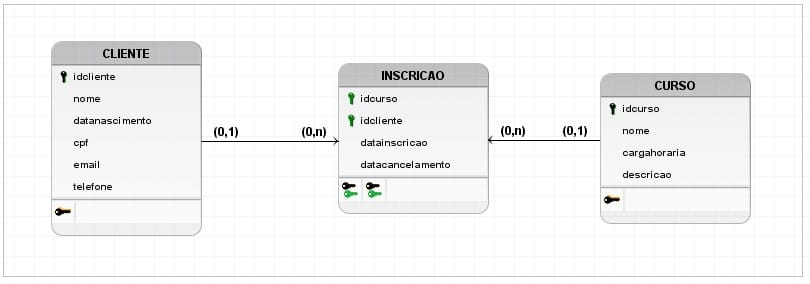
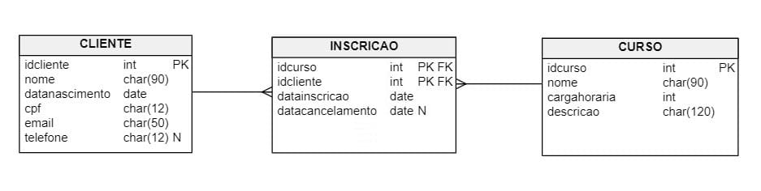
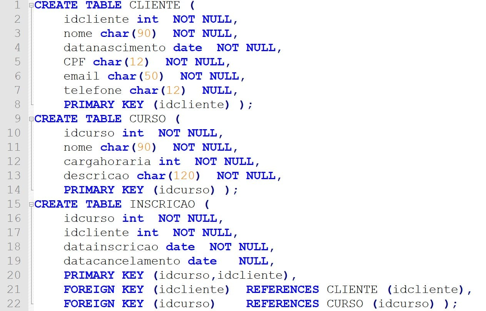

# Descrição

Descrição das etapas de um projeto de banco de dados e dos componentes de um
diagrama de entidade e relacionamento, além da modelagem de entidades e
relacionamentos e de atributos.

# Identificar as etapas de um projeto de banco de dados

### Projeto de banco de dados

#### Projeto conceitual

O projeto ou esquema conceitual envolve construir um modelo de dados de alto
nível a partir dos requisitos de dados que contêm os principais objetos e seus
relacionamentos, mapeados na etapa de levantamento de requisitos. Nesta etapa,
não há preocupação em saber detalhes sobre como os dados devem ser armazenados.

O projeto conceitual usa um diagrama gráfico, conhecido por Diagrama de
Entidade e Relacionamento (DER), que possui três elementos essenciais:
entidades, relacionamentos e atributos. Em um DER, cada entidade é representada
por um retângulo com o seu nome. De forma semelhante, cada relacionamento, por
um losango ligado por linhas aos retângulos das entidades participantes do
relacionamento.

  

A partir desse diagrama, é possível concluir que o modelo possui duas entidades
(CLIENTE e CURSO) cuja função é armazenar os dados dos clientes e dos cursos da
escola. Além disso, essas entidades possuem uma relação entre si, de maneira
que um cliente pode fazer inscrição em um ou mais cursos.

#### Projeto lógico

O projeto lógico, também conhecido por modelo de dados de baixo nível, objetiva
transformar o modelo conceitual em um modelo lógico, que depende do tipo de
SGBD escolhido.

  

No modelo relacional, as entidades de um DER são representadas sob o formato de
tabelas, por isso, no exemplo, aparecem as tabelas CLIENTE e CURSO. Em
especial, a mesma decisão foi tomada para representar o relacionamento
INSCRICAO. Perceba que nesse ponto do projeto ainda não definiremos as
características dos atributos, tais como tipos de dados e tamanho. Basta apenas
que eles estejam vinculados às suas tabelas.

#### Projeto lógico

Durante o projeto físico, definimos os detalhes de implementação dos objetos do
banco de dados. No caso das tabelas, escolhemos os tipos de dados e tamanho das
colunas, e especificamos se elas são opcionais ou obrigatórias.

Os relacionamentos são definidos por uma restrição especial em alguma(s)
coluna(s) da tabela em questão. Esse tipo de restrição é denominado __chave
estrangeira__. Em geral, o projeto físico é realizado com o auxílio de alguma
ferramenta gráfica de modelagem. Há inclusive ferramentas que funcionam online,
muitas vezes com a política de oferecer acesso limitado a diversos recursos.

  

Observe que, diferentemente do modelo lógico, cada coluna de tabela no modelo
está especificada com detalhes relativos ao tipo de dados, além de restrições
em algumas colunas indicadas pelos marcadores FK, PK e N.

A imagem acima trata-se da modelagem física rica em detalhes que antecede a
implementação no banco com DDL SQL.

> Glossário:
>   - FK = foreign key;
>   - PK = primary key;
>   - N = null;
>   - SQL = structured query language;
>   - DDL = data definition language;

Na criação do esquema do banco de dados, nós utilizamos uma linguagem
declarativa, denominada linguagem de consulta estruturada SQL. A parte da SQL
que fornece essas funcionalidades é denominada Linguagem de Definição de Dados.
A Figura 5 apresenta um script DDL SQL compatível com o modelo escola.

  

Um script SQL DDL é um conjunto de comandos que, no contexto do nosso exemplo,
servirão para criar as tabelas do banco de dados escola.